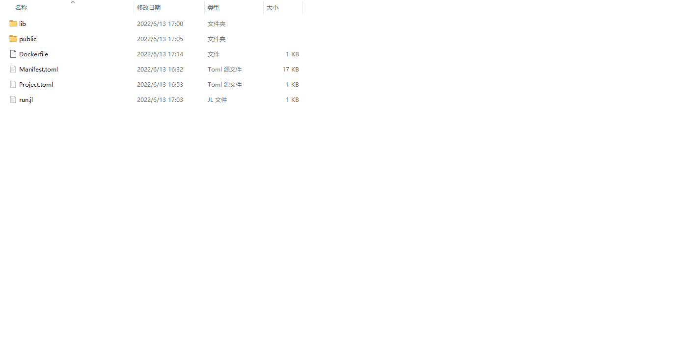
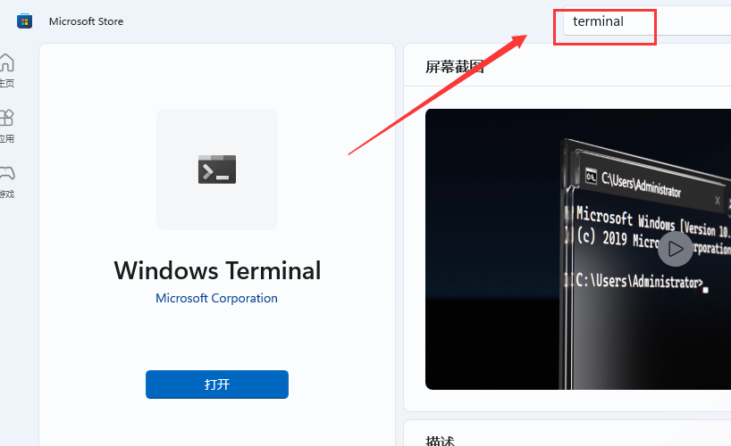
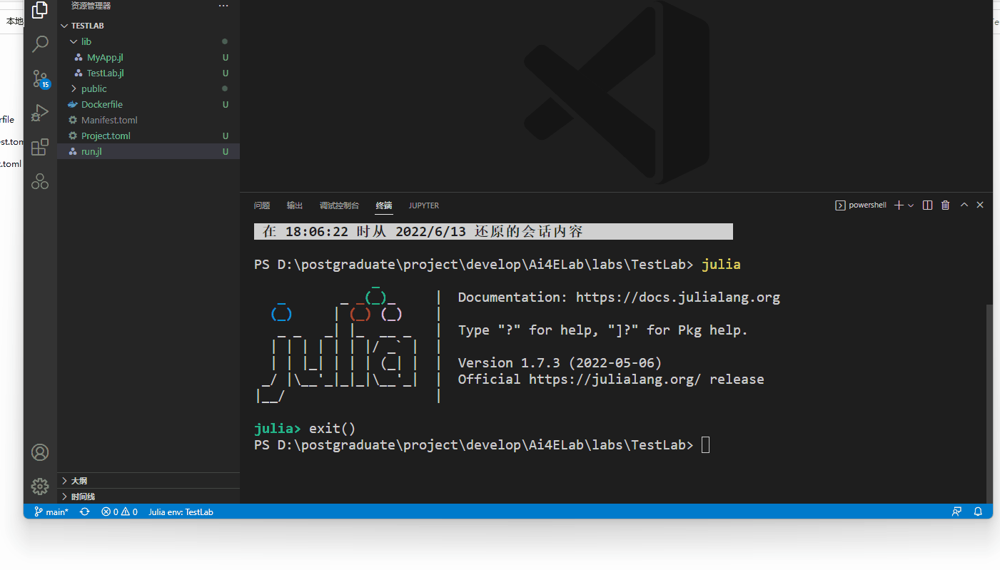
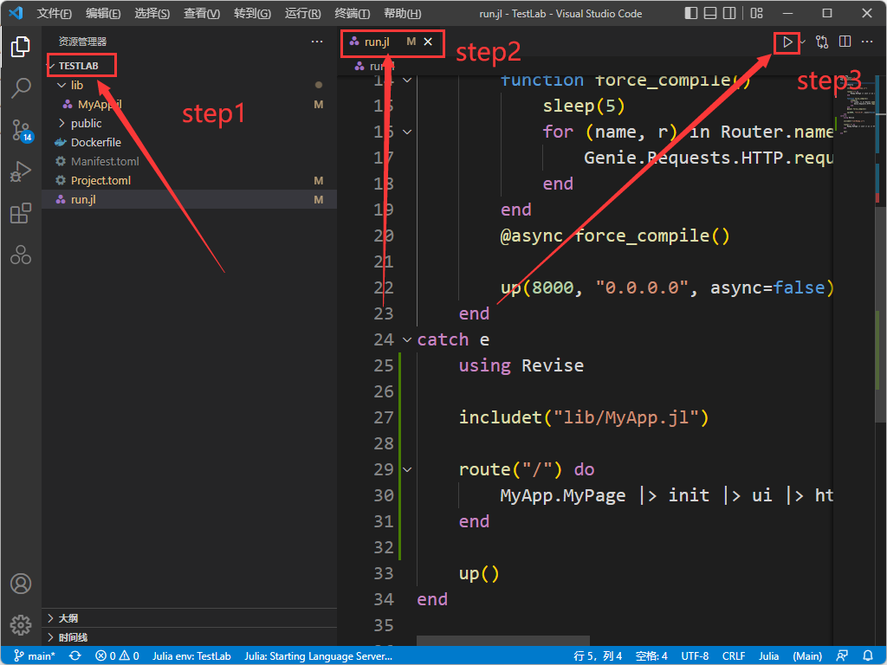

# Quick Start

在开始之前，让我们先学会如何在本地运行程序。先把程序跑起来！

## 文件结构介绍

以`TestLab`文件夹为例介绍文件结构，文件夹结构如下：

```powershell
TestLab/
├── lib/
│   └── MyApp.jl
├── public/
│   └── favicon.ico
├── Dockerfile
├── Project.toml
└── run.jl
```

* `lib/`包含了网页的主要设计部分，是核心
* `public/`包含了Ai4E的图标，**不改动**
* `Dockerfile`是docker的部署文件，**不改动**
* `Project.toml`是项目的包依赖信息文件，**需要部分手动改动**，后面介绍
* `run.jl`是App的启动文件，**一般来说不改动**

## 启动方法

运行本地程序的本质是在**本地启动Web服务器**。本地启动服务，那么自己的电脑就作为了个服务器，自己服务自己。

具体步骤有2步：

* Step1：在该App文件夹内打开终端（Powershell或VScode）
* Step2：进入Julia，环境切换到该文件夹，并启动服务。

### Step1

在项目文件夹，右键选择PowerShell或VScode。这两种形式本质上相同，VScode中只是将PowerShell嵌入了而已。

个人习惯用VScode，因为编辑程序也可以在VScode里进行，后面就不用来回切换了。



!!! tip
    * 如果在VScode中不见终端，在窗口上方操作栏的终端里新建终端或右边第二个按钮调出终端面板。
      
    * 如果没有PowerShell，微软商店里下载：
      

### Step2

Step2的具体步骤如下，**有两种方法**：

#### 方法1

```julia
TestLab> julia #进入Julia
julia> #按下 ] 键进入包模式
(@v1.x) pkg> activate .
(TestLab) pkg> instantiate
(TestLab) pkg> #按下 回退<backspace> 键退出包模式 
julia> include("run.jl") #开启服务器
```

* **注意`activate`后面的点**，意思是激活当前文件夹的环境。能激活的原因是存在`Project.toml`。
* `instantiate`是实例化环境的意思，就是在当前环境下把`Project.toml`中的包以及他们的包部署到位。

!!! tip
    上述过程中，按下`Tab`键可以自动补全代码。
    同时，上述步骤中有多此一举的做法，这个留给大家自己去思考发现

示意图如下：



最后就启动了服务器了，按下`Ctrl`键点击http链接，就能在网页中看到了本地运行的Web程序了！（Warning可以不用管）


#### 方法2

方法二很简单，在Step1的基础上：

1. 确认是否在App项目文件夹
2. 打开run.jl文件
3. 点箭头运行

如图所示：

  

### 关闭服务器

如果需要关闭服务器，那么输入：

```julia
julia> down()
```

  
